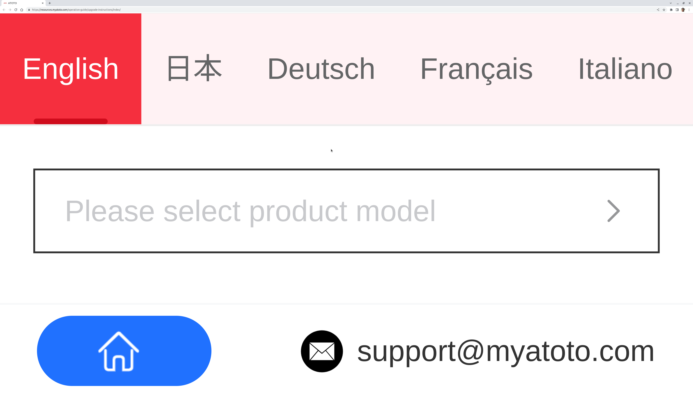

# About

I wrote a Python script called all [atoto_firmware_downloader.py](./atoto_firmware_downloader.py) that allows you to download firmware for [ATOTO's](https://www.myatoto.com/index) [CarPlay](https://en.wikipedia.org/wiki/CarPlay) radios.

I wrote this tool because the ATOTO firmware download site is horrible -- seriously -- this is a screenshot of it, and painful to use.



# Firmware

The output.txt file in this directory contains the list of firmware versions available.

**The firmware files are stored on Google Drive**, not Git LFS, due to pricing: **https://drive.google.com/drive/folders/1P3aI2oLnxMXsd2c4d2LnmvnJYujgN5Gi?usp=sharing**

Here's the list of products supported:

```
['A6G209PF',
 'A6G2A7KL',
 'A6G2A7PF',
 'A6G2A7PF-S01',
 'A6G2A7PF-S02',
 'A6G2B7PF',
 'A6G2B7PF-S01',
 'A6OP07APF',
 'A6TYC7PF',
 'A6VW07APF',
 'A6VW09PF',
 'A6Y1010SB',
 'A6Y1021PR',
 'A6Y1021PRB-G',
 'A6Y2710S',
 'A6Y2710SB',
 'A6Y2721P',
 'A6Y2721PB',
 'A6Y2721PR',
 'A6Y2721PR-G',
 'A6Y2721PRB',
 'A6Y2721PRB-G',
 'A6YTY710S',
 'A6YTY721P',
 'A6YTY721PR',
 'A6YVW710PB',
 'A6YVW721PRB',
 'A6YVW821P',
 'F7G110XE-A',
 'F7G110XE-EU',
 'F7G110XE-EU2',
 'F7G110XE-NA',
 'F7G110XED',
 'F7G1A8PE-A',
 'F7G1A8PE-EU',
 'F7G1A8PE-NA',
 'F7G1A8SE',
 'F7G1A8XE-A',
 'F7G1A8XE-A-S01',
 'F7G1A8XE-EU',
 'F7G1A8XE-EU-S01',
 'F7G1A8XE-NA',
 'F7G1A8XE-NA-S01',
 'F7G209SE',
 'F7G210PE-A',
 'F7G210PE-EU',
 'F7G210PE-NA',
 'F7G210XE-AL',
 'F7G210XE-EU',
 'F7G210XE-NA',
 'F7G211SE',
 'F7G211WE',
 'F7G211WE-EU2',
 'F7G211XE-AL',
 'F7G211XE-EU',
 'F7G211XE-EU2',
 'F7G211XE-NA',
 'F7G211XED',
 'F7G2A7SE',
 'F7G2A7SE-S01',
 'F7G2A7WE',
 'F7G2A7WE-S01',
 'F7G2A7XE-A',
 'F7G2A7XE-A-S01',
 'F7G2A7XE-AL',
 'F7G2A7XE-EU',
 'F7G2A7XE-EU-S01',
 'F7G2A7XE-EU2',
 'F7G2A7XE-NA',
 'F7G2A7XE-NA-S01',
 'F7G2A7XED',
 'F7G2A7XED-S01',
 'F7G2B7PE-A',
 'F7G2B7PE-EU',
 'F7G2B7PE-NA',
 'F7G2B7WE',
 'F7G2B7WE-S01',
 'F7G2B7XE-A',
 'F7G2B7XE-EU',
 'F7G2B7XE-NA',
 'F7G2B7XED',
 'F7TYC7SE',
 'F7TYC7XE-A',
 'F7TYC7XE-EU',
 'F7TYC7XE-NA',
 'F7超级版10寸百变机(三类-日本包装) F7G211XE-A',
 'S8G1A83LT',
 'S8G1A84SD',
 'S8G2094LT',
 'S8G2098LT',
 'S8G2099LT',
 'S8G2101S',
 'S8G2103M',
 'S8G2104PM',
 'S8G2104PR-A',
 'S8G2104PR-N',
 'S8G2108U-A',
 'S8G2108U-N',
 'S8G2109UP-A',
 'S8G2109UP-N',
 'S8G2113LT',
 'S8G2114PM',
 'S8G2118LT',
 'S8G2119UP-A',
 'S8G2119UP-N',
 'S8G2A71S',
 'S8G2A73LT',
 'S8G2A74PM',
 'S8G2A74PR-A',
 'S8G2A74PR-N',
 'S8G2A74SD',
 'S8G2A75P',
 'S8G2A78U-A',
 'S8G2A78U-N',
 'S8G2A78UL-A',
 'S8G2A78UL-N',
 'S8G2A79UP-A',
 'S8G2A79UP-N',
 'S8G2B73M',
 'S8G2B74MS-A-p2',
 'S8G2B74MS-A-p3',
 'S8G2B74MS-N-p1',
 'S8G2B74PM',
 'S8G2B74PR-A',
 'S8G2B74PR-N',
 'S8G2B75PL',
 'S8TYC73LT',
 'S8TYC74PM',
 'S8TYC78UL-A',
 'S8TYC78UL-N',
 'S8VW114SD',
 'S8VW118UL-A',
 'S8VW118UL-N',
 'YS102C',
 'YS102SL',
 'YS102SL-W',
 '[7寸通用机大众套装]A6 VW 大众专用机 A6VW07APF(=A6G2A7PF+AC-VW701-ST)']

```

# Usage

If you want to run this script, simply run:

```bash
$ python3 atoto_firmware_downloader.py
```

The script takes no arguments and has no dependencies. As of this writing, the total firmware folder is about 82 GB.

